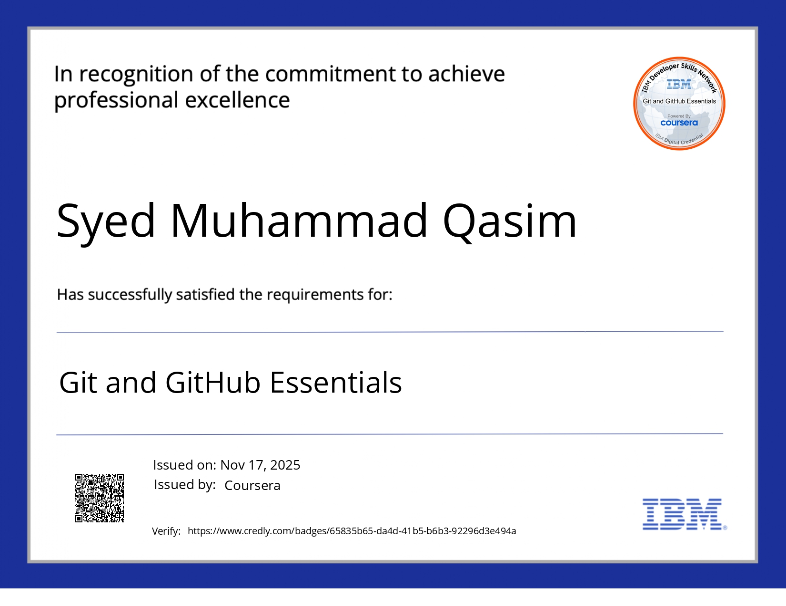
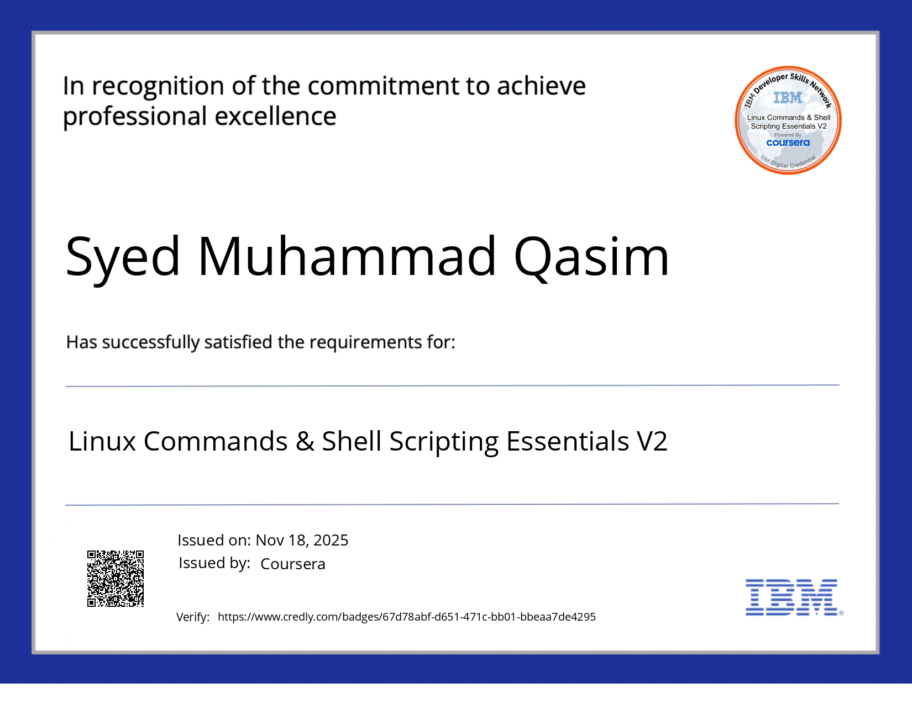

# Linux + GIt-hub  
** Cloud/DevOps –  2025**

  


**LIVE LAB PROOF**  
Successfully tested on **KodeKloud Ubuntu VM**  
[See lab-proof.txt](lab-proof.txt)

---

## Files
- `cheatsheet.md` → 40+ Linux commands
- `setup.sh` → Install Python + boto3
- `log_parser.py` → Parse logs with Python
- `README.md` → This file

## How to Run

```bash
# 1. Install dependencies
chmod +x setup.sh
./setup.sh

# 2. Run log parser (on server with nginx)
python3 log_parser.py
